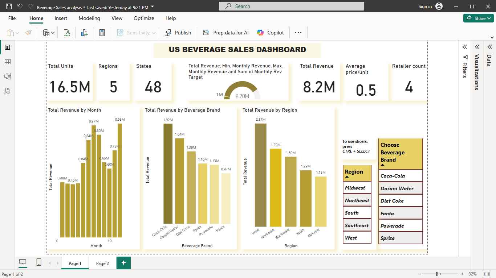
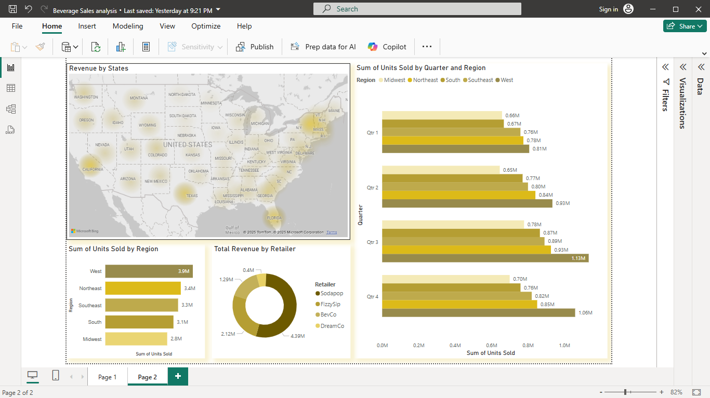
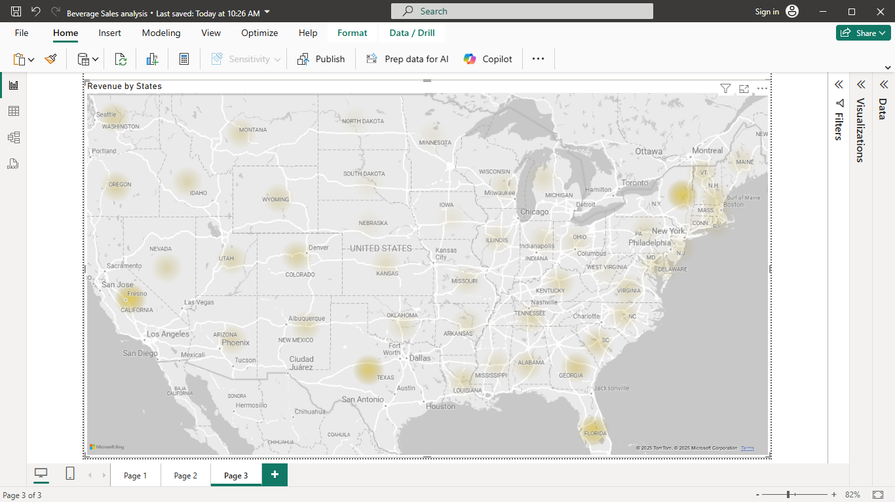

This report shows the analysis of US beverage sales, capturing yearly, quarterly, monthly, states and regional metrics as seen in dashboard. Listed below are findings from analysis of the US beverage data.

###### _Beverage Sales Dashboard_

## Key Findings
    High-level Metrics
- Total Units Sold: Over 16 million units, a strong volume indicator.
- Regions Covered: 5 regions, showing broad market coverage in 48 states of the US, suggesting a decent retail network.
- Total Revenue: $8.2 million, which, when compared with units sold, gives an average price/unit of $0.48.
- Retailer Count: 4 major retailers, indicating sales are concentrated among a few key partners.

- Monthly Revenue: There is a clear upward trend in revenue by month, peaking in the last month shown (over $2.5M), which may indicate seasonality, promotions, or market growth.

- Beverage Brand Performance: Coca-Cola leads in total revenue among brands, followed by Dasani Water and Diet Coke. Sprite is the lowest among those listed, suggesting potential for growth or under-performance which needs to be checked urgently.

Regional Analysis
The dashboard allows filtering by region and beverage brand, which is useful for identifying regional strengths and brand-specific trends.    
    
    
    
The West region is the best performing region with 2.4M revenue generated and the Midwest region with 1.15M. There should be a sales promotion or a retailer swap in the Midwest region to promote sales.

###### _Map of the US showing heat-map of Revenue by States_.
    States		
Proper management/monitoring should be carried out with each state, because their performance directly affects regional sales performance and results.

    Quarterly Performance
 This chart compares the sum of units sold across different quarters for each region. Each region has four bars, showing quarterly performance side-by-side.

### Regional Leaders
- The West region consistently outperforms other regions in every quarter, with units sold exceeding 3M in some quarters.
- The Midwest region has the lowest sales across all quarters, with values below 1M units sold per quarter.

### Quarterly Trends 
- Most regions show a relatively stable trend in units sold across the quarters, with some minor fluctuations.
- There are no dramatic spikes or drops, suggesting steady sales performance throughout the year.

### Performance Gaps 
- There is a clear gap between the top-performing and bottom-performing regions, indicating potential for targeted strategies in lower-performing regions for instance regional targeted promotions.

